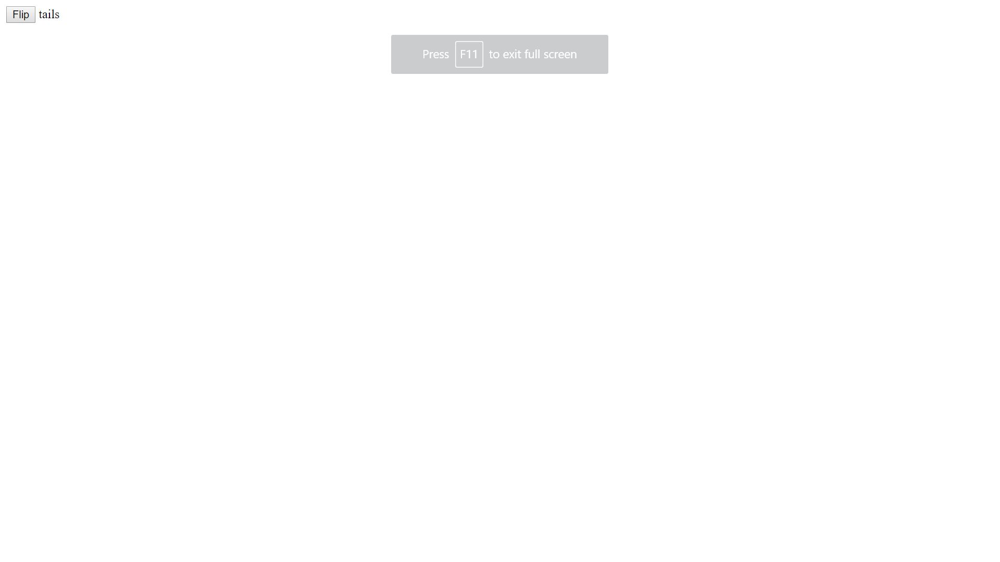

## Installation

1. Clone repo
2. run `npm install`

## Usage

1. run `node server.js`
2. Navigate to `localhost:8000`

Heads Tails Coinflip game
This project allows the user to flip a coin and be informed of what the coin landed on.

How It's Made:
Tech used: HTML, CSS, JavaScript, Node
the HTML was used to have the button that allows the user to flip the coin. Javascript was used to make the coinflip result be a random number via Math.random it also is used to generate an onclick event. Node is used to make server run locally.

Optimizations
I would like add a history of the previous coinflips so the user can see what they previously flipped.

Lessons Learned: This is one of my first apps created that uses node to make a local server.

Examples:
Take a look at these couple examples that I have in my own portfolio:
